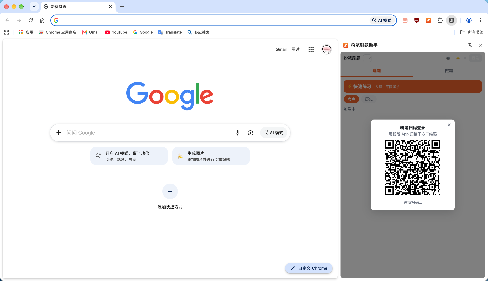
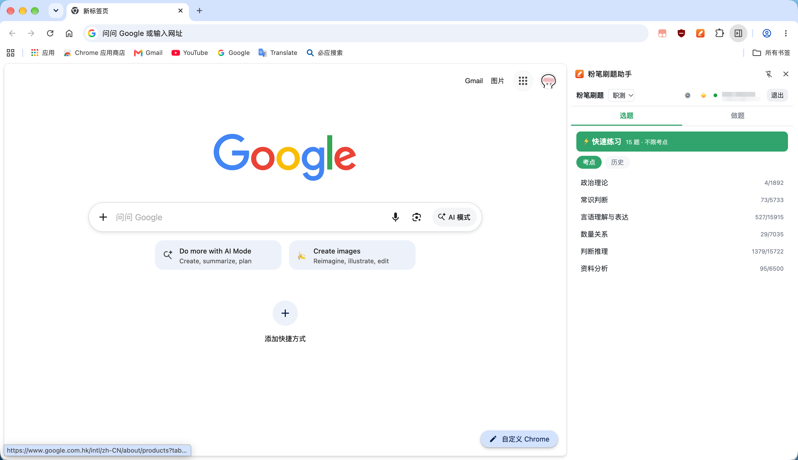
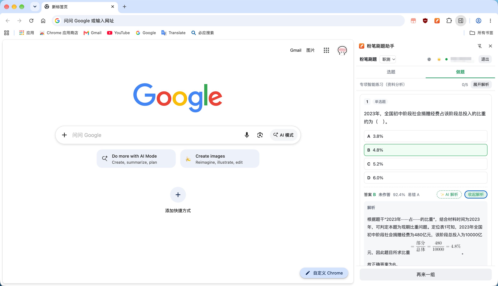

# fenbi-helper-chrome-extension

AI 写的粉笔插件，方便摸鱼刷题，加油

[](https://github.com/NanChaos/fenbi-helper-chrome-extension/actions/workflows/ci.yml)
[](https://github.com/NanChaos/fenbi-helper-chrome-extension/releases)
[](LICENSE)

## 预览






把粉笔（[fenbi.com](https://fenbi.com/)）的刷题能力搬到 **Chrome 侧边栏**里：一边看网页／写代码，一边做题，扫码登录、选题、作答、交卷、看解析、AI 讲解一条龙。

仓库里目前有两样东西：

| 目录 | 内容 |
| --- | --- |
| `chrome-extension/` | Chrome MV3 扩展（原生侧边栏，纯 JS 无构建） |
| `docs/fenbi-api-notes.md` | 粉笔 Web 端接口逆向笔记（登录 / 刷题 / 提交 / 解析 / 历史） |

## Chrome 扩展

### 功能

- **扫码登录**：二维码本地生成（`qrcodejs`），2.5s 轮询登录态，全程在侧边栏里完成
- **选题**：⚡ 快速智能练习（15 题不限考点）／按考点树练习／历史练习续做
- **作答**：单选即时写入服务端，顶栏显示进度 `7/15`
- **解析**：每题「答案 + 对错 + 全站正确率 + 易错项」，官方解析可单题展开也可一键全部展开
- **✨ AI 解析**：每条解析左侧按钮，调用你自己的大模型重新讲一遍（流式输出，可中断）
- **外观**：跟随系统 / 浅色 / 深色；9 种主题色（默认「粉笔橙」`#f2632a`），可自定义色值
- **AI 设置**：DeepSeek / OpenAI / 通义千问 / 智谱 GLM / Kimi / 豆包方舟 / 硅基流动 / Ollama / 自定义（OpenAI 兼容）

### 安装（未上架商店，走「加载已解压的扩展」）

**方式一：下载 Release zip（推荐）**

到 [Releases](https://github.com/NanChaos/fenbi-helper-chrome-extension/releases) 下载最新的
`fenbi-helper-chrome-extension-vX.Y.Z.zip`，解压到本地任意目录，然后按下面第 2 步加载即可。

**方式二：直接 clone**

```bash
git clone https://github.com/NanChaos/fenbi-helper-chrome-extension.git
```

1. `chrome://extensions` → 右上角打开 **开发者模式**
2. 点 **加载已解压的扩展程序** → 选择解压（或 clone）出来的 **`chrome-extension/`** 目录
3. 点扩展图标打开侧边栏；侧边栏左右/宽度由 Chrome 自己控制（侧边栏顶部图标切换）

> 更新代码后记得回 `chrome://extensions` 点一下扩展卡片上的 ⟳ 刷新。

### 目录结构

```
chrome-extension/
├── manifest.json            MV3；side_panel + options_page
├── api/
│   ├── fenbi-api.js         粉笔接口层（与运行环境无关，末尾带 module.exports）
│   └── ai-providers.js      AI 平台预设 + OpenAI 兼容流式调用 + 外观应用
├── background/sw.js         setPanelBehavior：点图标直接开侧边栏
├── panel/                   侧边栏（选题 / 做题）
├── options/                 设置页（外观 / AI）
├── vendor/qrcode.min.js     离线二维码库
└── icons/
```

### AI 解析怎么用

设置页选平台、填 API Key、`/models` 拉取或直接填模型 → **保存**（会顺带申请一次该域名的访问权限）→ 回到侧边栏点任意一道题的「✨ AI 解析」。

Key 只存在本机 `chrome.storage.local`，不会上传任何第三方。请求由你的浏览器直连你所配置的平台。

### 实现要点

想二次开发的话，这几条是踩出来的：

1. **登录凭证是 HttpOnly Cookie**（`.fenbi.com`），扩展靠 `host_permissions` + `credentials: 'include'` 带上
2. **两步取题**：`getExercise` 拿 `requestKey` → `static/exercise` 拿题干，不能跳步
3. **已交卷的练习必须走 solution 链路**：此时 `getExercise` 的 `requestKey` 已失效（返回 `invalid request key`），要用 `getSolution`（自带 `userAnswers`）+ `static/solution`（自带题干 / 选项 / 答案 / 解析）
4. **快速智能练习 = 创建练习时不传 `keypointId`**，题量服务端恒定 15
5. **MV3 下扩展页跨域 fetch 必须有目标 host 权限**，否则被 CORS 拦；预设域名放进 `optional_host_permissions` 按需申请

完整接口清单、参数与返回值见 [`docs/fenbi-api-notes.md`](docs/fenbi-api-notes.md)。

### CI/CD 与发版

| 工作流 | 触发时机 | 产物 |
| --- | --- | --- |
| [CI](.github/workflows/ci.yml) | push / PR 到 `main`，或手动触发 | 静态自检 + `ci-<sha>.zip`（Actions Artifact） |
| [Release](.github/workflows/release.yml) | ① push `main` 且 `manifest.json` 的 version 没发过 ② push tag `v*` ③ 手动触发（可指定版本 / 勾选 force 重发） | `fenbi-helper-chrome-extension-vX.Y.Z.zip` + GitHub Release |

发新版本只需两步：把 `chrome-extension/manifest.json` 的 `version` 加一，然后推到 `main`，Release 工作流会自动建 tag 并发版：

```bash
# 1. version: 0.7.0 -> 0.7.1
# 2.
git push origin main
```

也可以手动补发当前版本：Actions → Release → Run workflow（`tag` 留空即取 manifest 版本；版本已存在时勾选 `force` 覆盖产物）。

## 声明

本项目是对粉笔 Web 端的个人学习与自用工具，**并非粉笔官方产品**，与粉笔无任何关联。接口行为可能随时变动，请勿用于商业用途，也不要对服务端发起超出正常使用频率的请求。
